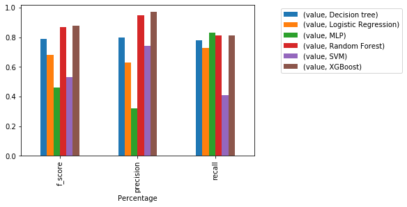

# Credit Card Fraud Analysis

Performance analysis of various ML models and ANN to predict the fradulent transection using credit card fraud data.

## Dataset

The datasets contains transactions made by credit cards in September 2013 by european cardholders.This dataset presents transactions that occurred in two days, where we have 492 frauds out of 284,807 transactions. The dataset is highly unbalanced, the positive class (frauds) account for 0.172% of all transactions.

[Download Dataset here](https://www.kaggle.com/mlg-ulb/creditcardfraud/data#)

## Models used

1. Logistic Regression
2. Decision Tree
3. Random Forest
4. XGBoost
5. SVM
6. ANN (MLP)

## Inspiration

This data is highly imbalanced, as it has only 0.172% transections that are fradulent. Here, I have tried above outlined models along with adding some weights to the class which belongs to the fraud transections. For measuring the accuracy, precision,recall and F-Score is used because confusion matrix is not meaningful for unbalanced classification.

## Installation:

All the required installation are mentioned in the requirements.txt

## File descriptions

* Fraud detection.ipynb – Evaluation of models without data normalisation
* Fraud Detection_processed.ipynb – Evaluation of models with data normalisation.

### Model evaluation results without data normalisation

### Model evaluation results with data normalisation